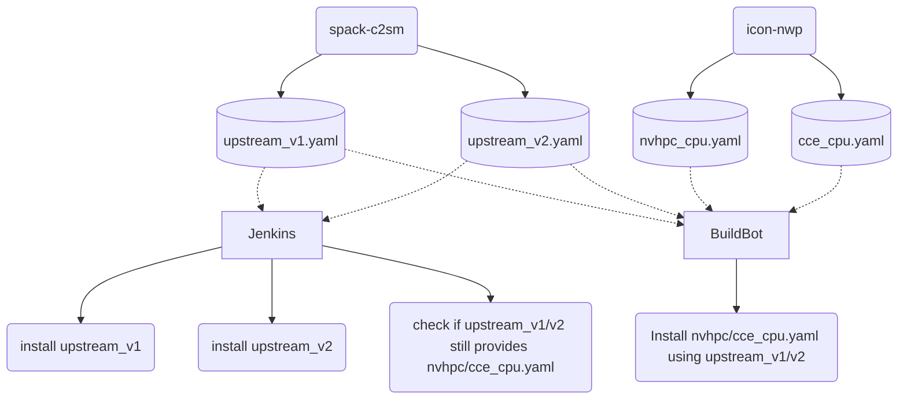

# CI for ICON with upstream instances and spack v0.18.1

```mermaid
graph TD;
    id10(spack-c2sm) --> id11 & id12
    id11[("upstream_v1.yaml")]
    id12[("upstream_v2.yaml")]

    id20(icon-nwp) --> id21 & id22
        id21[("nvhpc_cpu.yaml")]
        id22[("cce_cpu.yaml")]

    id30[Jenkins] --> id31 & id32 & id33
        id31(install upstream_v1)
        id32(install upstream_v2)
        id33(check if upstream_v1/v2 still provides nvhpc/cce_cpu.yaml)

    id40[BuildBot] --> id41
        id41(Install nvhpc/cce_cpu.yaml using upstream_v1/v2)

    id11 & id12 -.-> id30 & id40
    id21 & id22 -.-> id40
```
