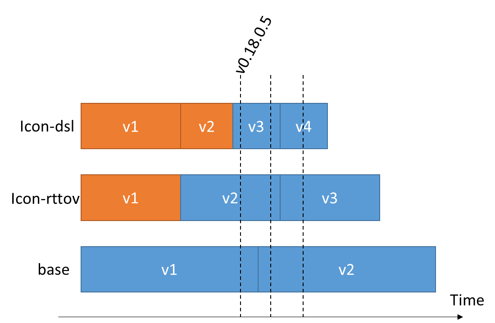

Upstream management
=====================================
spack-c2sm is aware of multiple upstream instances
providing pre-built dependencies. This is important for efficient builds during CI.
Additionally an overload of filesystems at CSCS is prevented because not every users install
its own software stack.

Install upstream
----------------------
The upstream instances are installed for each tag through a dedicated `Jenkinks plan (Install upstream) <https://jenkins-mch.cscs.ch/job/Spack/job/spack-upstream_v0.18.1.5/>`_.
Each new tag of spack-c2sm needs a new plan, it can simply be copied from existing one. The only thing to adapt is the default value of the spack-tag.

Uninstall upstream
----------------------
The upstream instances are uninstalled for each tag through a common `Jenkinks plan (Uninstall upstream) <https://jenkins-mch.cscs.ch/job/Spack/job/spack-delete-upstream/>`_ . No manual deletion of files in g110 needed.
In case multiple tags of spack-c2sm use the same version of an upstream a mechanism is programmed that checks if a given upstream is still used for future releases.
In that case the upstream is not removed.

   Installation scheme of upstream instances. If tag v0.18.0.5 is the oldest tag supported, the orange upstream instances can safely be removed.
